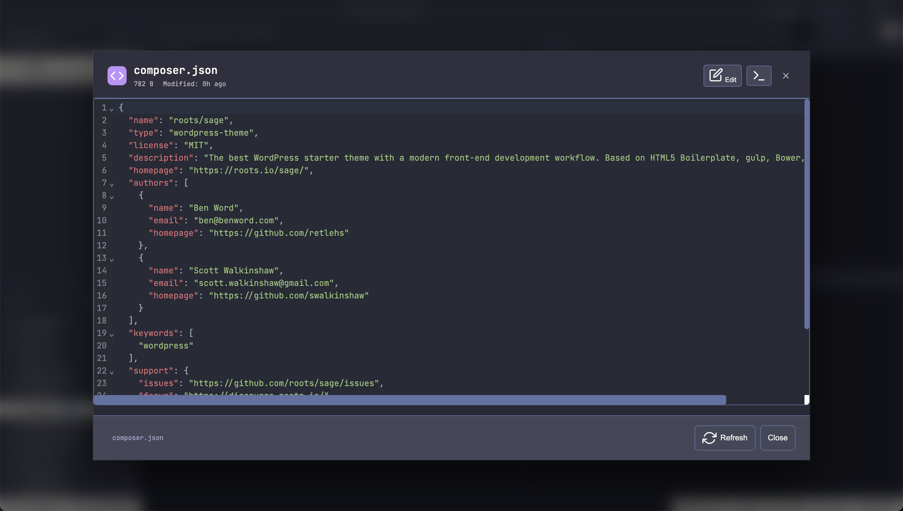
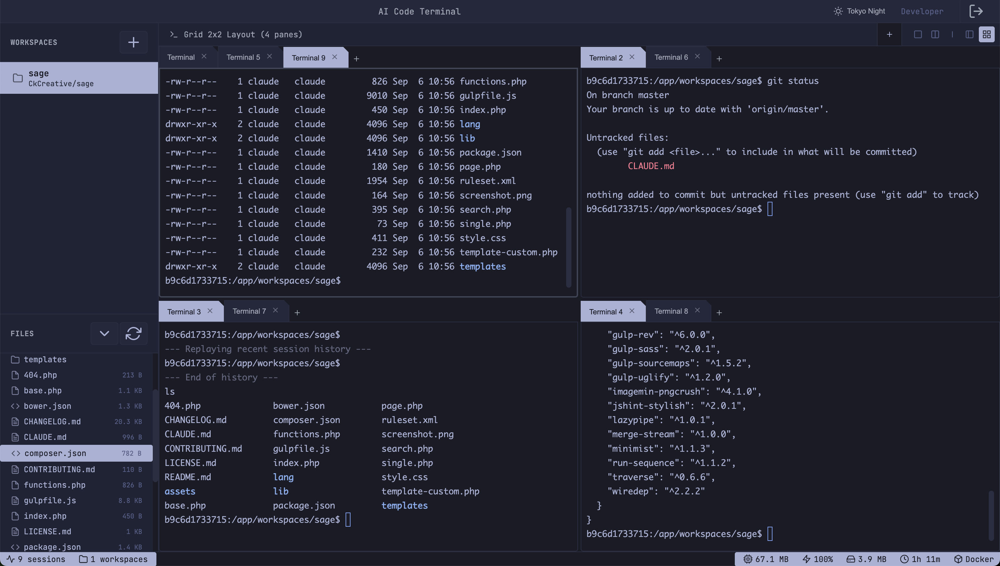
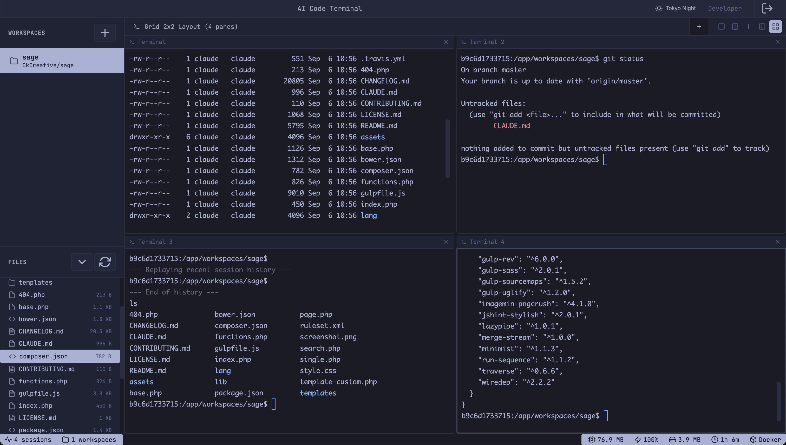
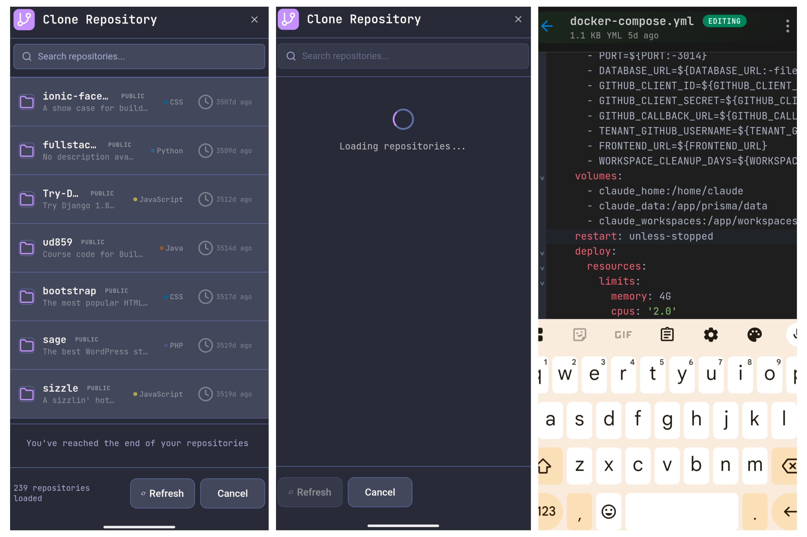
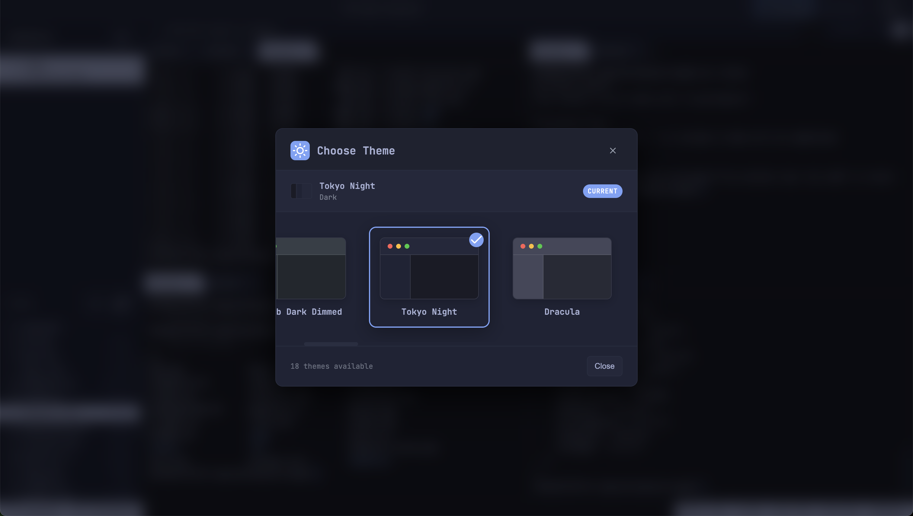

# AI Code Terminal (ACT)

[](https://github.com/drmhse/ai-code-terminal/actions/workflows/pr-tests.yml) [](https://coveralls.io/github/drmhse/ai-code-terminal?branch=main)

The modern development workflow is shifting back to the terminal, now supercharged by AI agents like Claude Code, Qwen-Code, and the Gemini CLI. Heavy, resource-intensive IDEs are no longer a prerequisite for productive coding. All you need is a powerful, integrated terminal environment.

ACT is a lightweight, terminal-centric web IDE that bridges the gap between a simple shell and a full-featured development environment. It provides a self-hosted, sovereign workspace with full shell access within a secure, isolated container environment. Built for developers who value speed, control, and the power of a minimal-footprint, AI-driven workflow.


Website: [act.drmhse.com](https://act.drmhse.com)

## Features

### Integrated File Explorer & Code Editor


*Built-in CodeMirror 6 editor with syntax highlighting for 15+ languages*

### Advanced Terminal Multiplexing


*Multiple terminal tabs with integrated file explorer and command history*


*Advanced split-pane layouts with synchronized file management*

### Mobile-First Repository Management


*Complete development environment accessible from any device*

### AI-Powered Development Workflow


*Seamless integration with CLI-based AI tools*

### Professional Theme Selection


*Choose from 18 carefully crafted themes with live preview*
*Consistent theming across terminals and interface elements*

## Philosophy

-   **Terminal-First Development:** ACT combines the power of a full-featured IDE with the simplicity and speed of a terminal-based workflow. Integrated file management, code editing, and advanced terminal multiplexing in one lightweight package.
-   **Lightweight & Fast:** While cloud IDEs replicate heavy desktop experiences, ACT provides essential development tools without the bloat. Fast, responsive, and uses minimal resources.
-   **AI-Native:** Designed from the ground up for a workflow centered around CLI-based AI tools. Your terminal becomes a conversation with your codebase.
-   **Absolute Sovereignty:** Your code, your AI interactions, and your environment are hosted on your infrastructure. No third-party access, no compromises.

## Core Features

### Integrated File Explorer & Code Editor
-   **Full-Featured File Browser:** Navigate directories, view files, and manage your project structure in an intuitive sidebar
-   **Built-in Code Editor:** Powered by CodeMirror 6 with syntax highlighting for 15+ languages (JavaScript, Python, Go, Rust, Java, CSS, HTML, SQL, and more)
-   **Direct File Editing:** Edit code directly in the browser with modern editor features

### Advanced Terminal Multiplexing
-   **Multiple Terminal Tabs:** Create and manage multiple terminal sessions per workspace
-   **Split Pane Layouts:** Organize terminals in horizontal, vertical, and grid layouts for maximum productivity
-   **Session Persistence:** Your terminal sessions survive browser refreshes and reconnections

### Long-Running Process Management
-   **Process Supervisor:** Automatically detect and track long-running commands (servers, build processes, etc.)
-   **Process Monitoring:** View, stop, and restart processes through the integrated interface
-   **Auto-Recovery:** Crashed processes can be automatically restarted

### System Resource Monitoring
-   **Real-Time Insights:** Status bar shows active sessions, CPU usage, memory consumption, and workspace storage
-   **Container-Aware:** Displays Docker container limits and resource utilization
-   **Performance Tracking:** Monitor your development environment's health at a glance

### Enterprise-Grade Security
-   **Secure Container Environment:** Full shell access within a security-hardened, isolated container
-   **Single-Tenant Authentication:** GitHub OAuth restricted to authorized users only
-   **Self-Hosted:** Complete control over your code, data, and AI interactions

### Developer Experience
-   **Develop From Any Device:** Turn a tablet, Chromebook, or phone into a viable development machine
-   **AI-Native Workflow:** Perfect integration with CLI-based AI tools like Claude Code, Qwen, and Gemini CLI
-   **Persistent Workspaces:** Clone GitHub repositories into isolated, persistent environments
-   **Enhanced Session Recovery:** Advanced session management survives network interruptions

## Getting Started

### Prerequisites

1.  **A Server:** Any machine that can run Docker (e.g., a cloud VM, home server, Raspberry Pi 4+).
2.  **GitHub Account:** The account you will authorize for access.
3.  **GitHub OAuth App:**
    -   Go to [GitHub Developer Settings](https://github.com/settings/developers).
    -   Create a new OAuth App.
    -   **Homepage URL:** `http://[your-server-ip/domain]:3014`
    -   **Authorization callback URL:** `http://[your-server-ip/domain]:3014/auth/github/callback`

### Quick Start with Docker Hub (Recommended)

1.  **Download the production configuration:**
    ```bash
    curl -O https://raw.githubusercontent.com/drmhse/ai-code-terminal/main/app/docker-compose.yml
    curl -O https://raw.githubusercontent.com/drmhse/ai-code-terminal/main/app/env.example
    ```

2.  **Configure your environment:**
    ```bash
    cp env.example .env
    nano .env  # Edit with your GitHub OAuth credentials
    ```

3.  **Start ACT using the pre-built image:**
    ```bash
    docker-compose up -d
    ```
    *This pulls the latest multi-platform image from Docker Hub (supports both AMD64 and ARM64)*

4.  **Access your environment:**
    Open `http://[your-server-ip/domain]:3014` in your browser and log in with your authorized GitHub account.

### Building from Source (Advanced)

1.  **Clone and build locally:**
    ```bash
    git clone https://github.com/drmhse/ai-code-terminal.git
    cd ai-code-terminal
    cp app/env.example app/.env
    nano app/.env  # Configure your settings
    ```

2.  **Start with development compose:**
    ```bash
    docker-compose -f app/docker-compose-dev.yml up -d --build
    ```

## Usage Workflow

1.  **Login:** Authenticate using the "Login with GitHub" button
2.  **Clone a Repository:** Browse and clone repositories from your GitHub account using the integrated repository browser
3.  **Select Your Workspace:** Choose the cloned repository to enter your development environment
4.  **Explore Your Code:** Use the integrated file explorer to navigate your project structure
5.  **Edit Files:** Click any file to open it in the built-in CodeMirror 6 editor with syntax highlighting
6.  **Organize Your Layout:** Create multiple terminal tabs or split panes to organize your workflow
7.  **Run Commands:** Execute builds, tests, and development servers with full shell access
8.  **Monitor Processes:** Track long-running processes through the integrated process supervisor
9.  **Power Up with AI:** Authenticate your favorite AI CLI and start building
    ```bash
    # Claude Code comes pre-installed
    claude auth login
    claude "help me refactor this component"

    # Install and use other AI tools
    npm install -g @google-ai/generativelanguage
    gemini "analyze my code quality"
    ```

## Environment Variables

All configuration is managed through environment variables. Copy `env.example` to `.env` and configure the following:

### Required Variables

| Variable                 | Required | Description                                     |
| ------------------------ | -------- | ----------------------------------------------- |
| `JWT_SECRET`             | Yes      | JWT signing secret (32+ characters)             |
| `GITHUB_CLIENT_ID`       | Yes      | GitHub OAuth App Client ID                      |
| `GITHUB_CLIENT_SECRET`   | Yes      | GitHub OAuth App Client Secret                  |
| `GITHUB_CALLBACK_URL`    | Yes      | The exact callback URL from your OAuth App      |
| `TENANT_GITHUB_USERNAME` | Yes      | A comma-separated list of GitHub usernames authorized to log in |

### Optional Variables

| Variable                 | Default | Description                                     |
| ------------------------ | ------- | ----------------------------------------------- |
| `NODE_ENV`              | `development` | Environment mode (`production`, `development`) |
| `PORT`                  | `3014`  | Server port number                               |
| `DATABASE_URL`          | `file:./data/database.db` | SQLite database path   |
| `FRONTEND_URL`          | -       | Frontend URL for CORS (separate deployment)     |
| `ALLOWED_ORIGINS`       | -       | Additional allowed CORS origins (comma-separated) |
| `WORKSPACE_CLEANUP_DAYS` | `30`    | Auto-cleanup inactive workspaces after N days  |

### Logging Configuration

| Variable                 | Default | Description                                     |
| ------------------------ | ------- | ----------------------------------------------- |
| `LOG_LEVEL`             | `info` (production), `debug` (development) | Logging level (error, warn, info, debug) |
| `LOG_MAX_SIZE`          | `20m`   | Maximum size of log files before rotation       |
| `LOG_MAX_FILES`         | `30d`   | Maximum age/number of log files to retain       |
| `LOG_COMPRESS`          | `true`  | Compress rotated log files (set `false` to disable) |

### Environment Configuration Examples

**Development Setup:**
```env
NODE_ENV=development
PORT=3014
JWT_SECRET=your-super-secure-jwt-secret-at-least-32-characters-long
DATABASE_URL=file:./data/database.db
GITHUB_CLIENT_ID=your-github-oauth-client-id
GITHUB_CLIENT_SECRET=your-github-oauth-client-secret
GITHUB_CALLBACK_URL=http://localhost:3014/auth/github/callback
TENANT_GITHUB_USERNAME=your-github-username,another-github-username
WORKSPACE_CLEANUP_DAYS=7
```

**Production Setup:**
```env
NODE_ENV=production
PORT=3014
JWT_SECRET=ultra-secure-production-jwt-secret-minimum-32-chars
DATABASE_URL=file:./data/database.db
GITHUB_CLIENT_ID=prod-github-oauth-client-id
GITHUB_CLIENT_SECRET=prod-github-oauth-client-secret
GITHUB_CALLBACK_URL=https://your-domain.com/auth/github/callback
TENANT_GITHUB_USERNAME=your-github-username,another-github-username
FRONTEND_URL=https://your-frontend-domain.com
ALLOWED_ORIGINS=https://your-domain.com,https://preview--your-app.netlify.app
WORKSPACE_CLEANUP_DAYS=30
```

## License

This project is licensed under the [GNU Affero General Public License v3.0](LICENSE).
