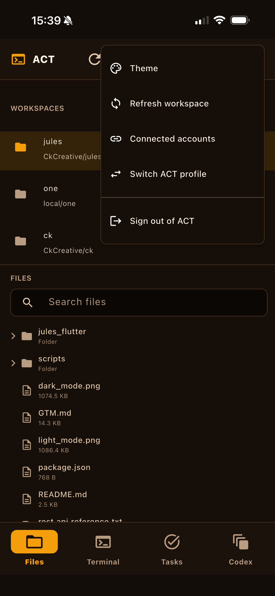
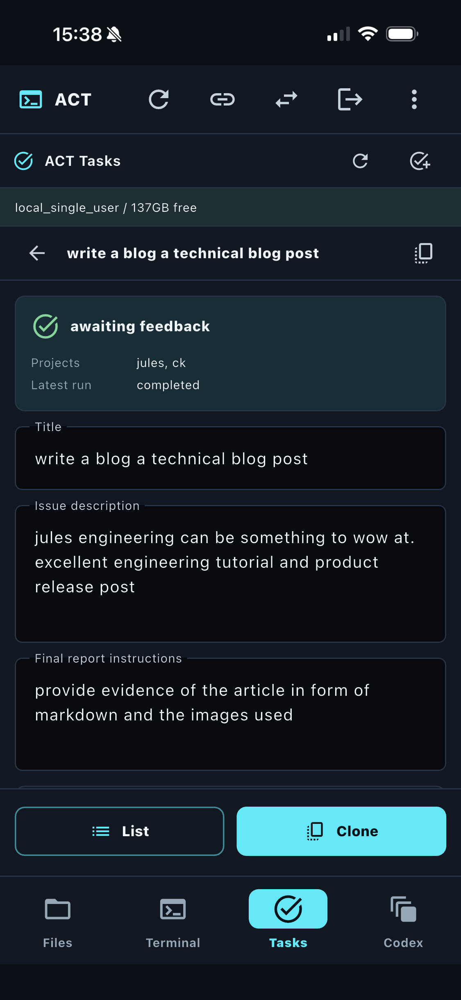
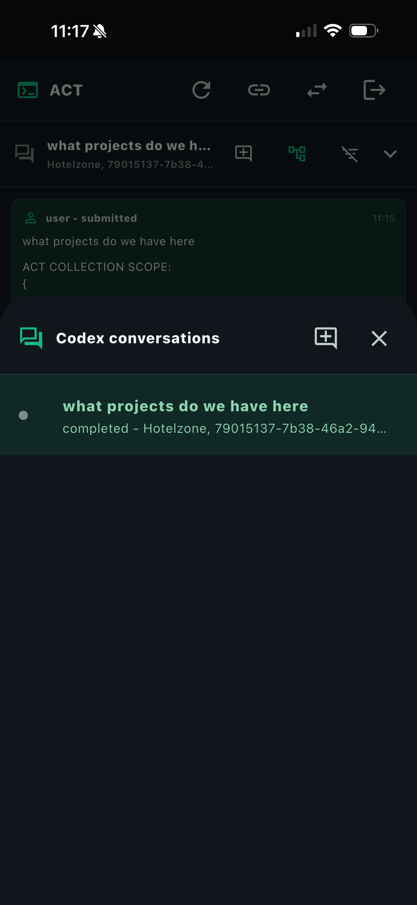
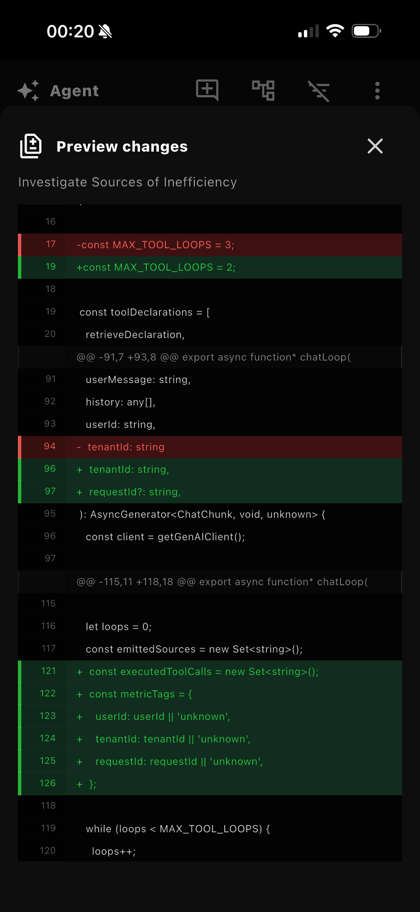
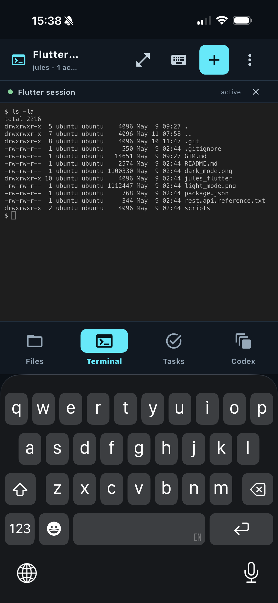
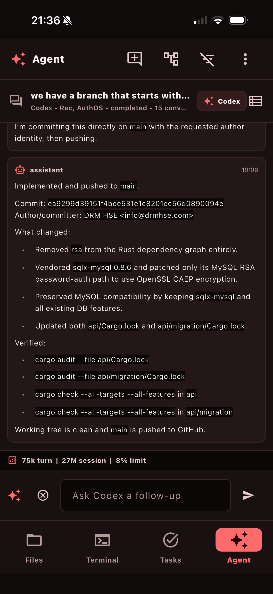
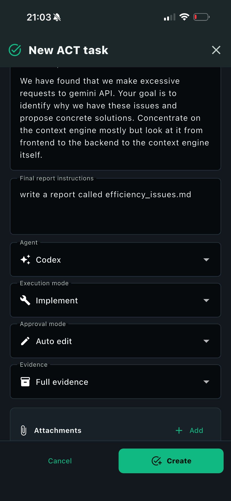
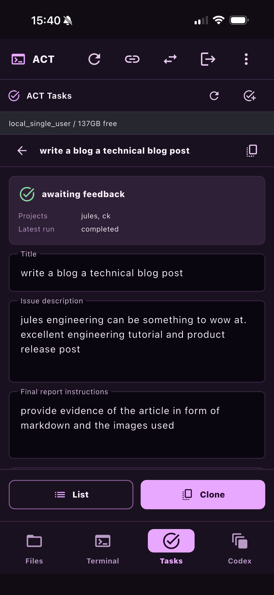

# AI Code Terminal (ACT)

ACT is a mobile-first AI code terminal for running real development work from a
phone, tablet, desktop, or browser. This public repository contains the Flutter
client, a static web demo, screenshots, and public docs.

The ACT backend is distributed as release binaries. Backend source is not part
of this public repository.

Try the static no-backend demo at [act.drmhse.com](https://act.drmhse.com/).

## Product Tour

ACT is built for the parts of engineering work that usually force you back to a
desktop: inspecting a repo, launching a terminal, asking an agent to make a
change, reviewing the diff, and shipping the result.

| Workspaces and files | Task creation |
| --- | --- |
|  |  |

| Agent threads | Diff review |
| --- | --- |
|  |  |

| Terminal | Commit workflow |
| --- | --- |
|  |  |

| Advanced task controls | Themes |
| --- | --- |
|  |  |

## What ACT Includes

- Multi-workspace project navigation with repo grouping and file search.
- Browser-grade terminal panes backed by the ACT server PTY runtime.
- Native ACT tasks with workspace scope, model selection, run evidence,
  artifacts, and pull request handoff.
- Codex/Pi session views with agent messages, tool calls, token/cost
  visibility, and changed-file review.
- GitHub repository access through the authenticated backend provider-token
  flow.
- Flutter clients for Android, iOS, macOS, and web.

## Repository Shape

- `frontend`: Flutter application for Android, iOS, macOS, and web.
- `website`: Static Flutter web demo output for Netlify.
- `screenshots`: README product screenshots.
- `tools` and `scripts`: Public frontend development helpers.

## Backend Binaries

Download ACT server binaries from the GitHub Releases page for this repository.
The release assets are built from the private ACT backend source and published
without including that source in this repository.

Typical Linux setup:

```bash
chmod +x act-server-linux-x86_64
./act-server-linux-x86_64
```

For ARM64 Linux hosts:

```bash
chmod +x act-server-linux-aarch64
./act-server-linux-aarch64
```

Runtime configuration is supplied through environment variables such as:

```text
ACT_DATABASE_URL=sqlite:/var/lib/act/act.db
ACT_SERVER_HOST=127.0.0.1
ACT_SERVER_PORT=3001
ACT_PUBLIC_URL=https://act.example.com
ACT_STATIC_FILES=/opt/act/frontend
ACT_CORS_ALLOWED_ORIGINS=https://act.example.com
```

The backend health endpoint is:

```text
GET /api/v1/health
```

## License

The public frontend source in this repository is licensed under the MIT License.
See `LICENSE`.

The ACT backend server binaries attached to GitHub Releases are licensed under
the GNU Affero General Public License v3.0. See `BACKEND_BINARY_LICENSE`.

## Flutter Frontend

```bash
cd frontend
flutter pub get
flutter run -d macos
```

Other direct Flutter targets:

```bash
flutter run -d chrome
flutter run -d ios
flutter run -d android
```

For Android emulator development, the app defaults to `http://10.0.2.2:3001`.
For macOS, iOS simulator, and web it defaults to `http://localhost:3001`.
Override deployed service URLs with `--dart-define=ACT_API_BASE_URL=...` and
`--dart-define=AUTHOS_BASE_URL=...`.

## Static Mock Website

The public website at `act.drmhse.com` is a static Flutter web build that runs
ACT in demo mode without connecting to a backend:

```bash
cd frontend
flutter build web --release --dart-define=ACT_MOCK_MODE=true
```

That build writes static files to `frontend/build/web`. The public
`ai-code-terminal` repository publishes those files from `website/`.

## Verification

```bash
npm run check:loc

cd frontend
flutter analyze
flutter test
```
