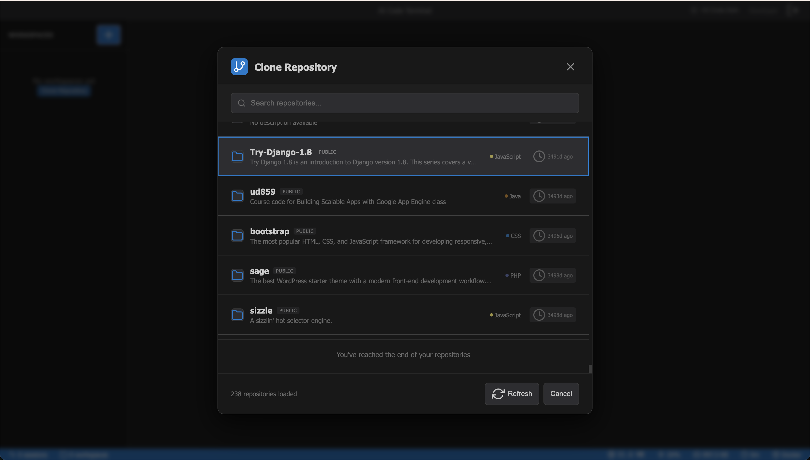

# AI Code Terminal (ACT)

[](https://github.com/drmhse/ai-code-terminal/actions/workflows/pr-tests.yml) [](https://coveralls.io/github/drmhse/ai-code-terminal?branch=main)

The modern development workflow is shifting back to the terminal, now supercharged by AI agents like Claude Code, Qwen-Code, and the Gemini CLI. Heavy, resource-intensive IDEs are no longer a prerequisite for productive coding. All you need is a shell.

ACT is the bridge to this new paradigm. It is a self-hosted, sovereign environment that gives you a persistent, root-level shell accessible from any browser, on any device. It is built for the developer on the go, who values speed, control, and the power of a minimal-footprint, AI-driven workflow.


Website: [act.drmhse.com](https://act.drmhse.com)

## Features

### Access your favorite AI agents from the browser; a terminal that's truly portable and lightweight


### Clone a github repository and start coding



### Customize your terminal experience


## Philosophy

-   **The Post-IDE Era:** In 2025, a powerful shell is a complete development environment. ACT provides that environment, wherever you are.
-   **Lightweight & Fast:** While cloud IDEs replicate heavy desktop experiences, ACT environment is a single, lean shell process. It's fast, responsive, and uses minimal resources.
-   **AI-Native:** Designed from the ground up for a workflow centered around CLI-based AI tools. Your terminal becomes a conversation with your codebase.
-   **Absolute Sovereignty:** Your code, your AI interactions, and your environment are hosted on your infrastructure. No third-party access, no compromises.

## Features

-   **Develop From Any Device:** Turn a tablet, a Chromebook, or even a phone into a viable development machine with a persistent, powerful shell.
-   **The AI-Native Shell:** Perfect for modern tools like `claude`, `qwen`, and `gemini-cli`. Let AI agents read your code, write tests, and run commands in a secure, contained environment.
-   **God-Mode Terminal Access:** A high-fidelity, browser-based terminal with full root access. Use `git`, `ssh`, `docker`, and anything else you need.
-   **Persistent Workspaces:** Clone your GitHub repositories into isolated, persistent workspaces on your server. Your session stays alive even when you close the browser.
-   **Secure & Self-Hosted:** Authenticates a single GitHub user. Deploy in minutes with a security-hardened Docker container on your own hardware.

## Getting Started

### Prerequisites

1.  **A Server:** Any machine that can run Docker (e.g., a cloud VM, home server, Raspberry Pi 4+).
2.  **GitHub Account:** The account you will authorize for access.
3.  **GitHub OAuth App:**
    -   Go to [GitHub Developer Settings](https://github.com/settings/developers).
    -   Create a new OAuth App.
    -   **Homepage URL:** `http://[your-server-ip/domain]:3014`
    -   **Authorization callback URL:** `http://[your-server-ip/domain]:3014/auth/github/callback`

### Docker Compose (Recommended)

1.  Clone this repository:
    ```bash
    git clone https://github.com/drmhse/ai-code-terminal.git
    cd ai-code-terminal
    ```

2.  Create and edit a `.env` file:
    ```bash
    cp env.example .env
    nano .env
    ```

3.  Fill in your details, especially `JWT_SECRET`, your GitHub OAuth credentials, and your `TENANT_GITHUB_USERNAME`.

4.  Start the application:
    ```bash
    docker-compose up -d
    ```

5.  Open `http://[your-server-ip/domain]:3014` in your browser and log in with your authorized GitHub account.

## Usage Workflow

1.  **Login:** Authenticate using the "Login with GitHub" button.
2.  **Clone a Workspace:** Clone a repository from your GitHub account.
3.  **Enter the Shell:** Select the workspace to launch the terminal.
4.  **Power Up with AI:** Authenticate your favorite AI CLI and start building.
    ```bash
    # Example for Claude Code (baked into the image)
    claude

    # Example for Gemini CLI (if installed)
    gemini

    # Example for Qwen-Code (if installed)
    qwen
    ```

## Environment Variables

All configuration is managed through environment variables. Copy `env.example` to `.env` and configure the following:

### Required Variables

| Variable                 | Required | Description                                     |
| ------------------------ | -------- | ----------------------------------------------- |
| `JWT_SECRET`             | Yes      | JWT signing secret (32+ characters)             |
| `GITHUB_CLIENT_ID`       | Yes      | GitHub OAuth App Client ID                      |
| `GITHUB_CLIENT_SECRET`   | Yes      | GitHub OAuth App Client Secret                  |
| `GITHUB_CALLBACK_URL`    | Yes      | The exact callback URL from your OAuth App      |
| `TENANT_GITHUB_USERNAME` | Yes      | A comma-separated list of GitHub usernames authorized to log in |

### Optional Variables

| Variable                 | Default | Description                                     |
| ------------------------ | ------- | ----------------------------------------------- |
| `NODE_ENV`              | `development` | Environment mode (`production`, `development`) |
| `PORT`                  | `3014`  | Server port number                               |
| `DATABASE_URL`          | `file:./data/database.db` | SQLite database path   |
| `FRONTEND_URL`          | -       | Frontend URL for CORS (separate deployment)     |
| `ALLOWED_ORIGINS`       | -       | Additional allowed CORS origins (comma-separated) |
| `WORKSPACE_CLEANUP_DAYS` | `30`    | Auto-cleanup inactive workspaces after N days  |

### Environment Configuration Examples

**Development Setup:**
```env
NODE_ENV=development
PORT=3014
JWT_SECRET=your-super-secure-jwt-secret-at-least-32-characters-long
DATABASE_URL=file:./data/database.db
GITHUB_CLIENT_ID=your-github-oauth-client-id
GITHUB_CLIENT_SECRET=your-github-oauth-client-secret
GITHUB_CALLBACK_URL=http://localhost:3014/auth/github/callback
TENANT_GITHUB_USERNAME=your-github-username,another-github-username
WORKSPACE_CLEANUP_DAYS=7
```

**Production Setup:**
```env
NODE_ENV=production
PORT=3014
JWT_SECRET=ultra-secure-production-jwt-secret-minimum-32-chars
DATABASE_URL=file:./data/database.db
GITHUB_CLIENT_ID=prod-github-oauth-client-id
GITHUB_CLIENT_SECRET=prod-github-oauth-client-secret
GITHUB_CALLBACK_URL=https://your-domain.com/auth/github/callback
TENANT_GITHUB_USERNAME=your-github-username,another-github-username
FRONTEND_URL=https://your-frontend-domain.com
ALLOWED_ORIGINS=https://your-domain.com,https://preview--your-app.netlify.app
WORKSPACE_CLEANUP_DAYS=30
```

## License

This project is licensed under the [GNU Affero General Public License v3.0](LICENSE).
