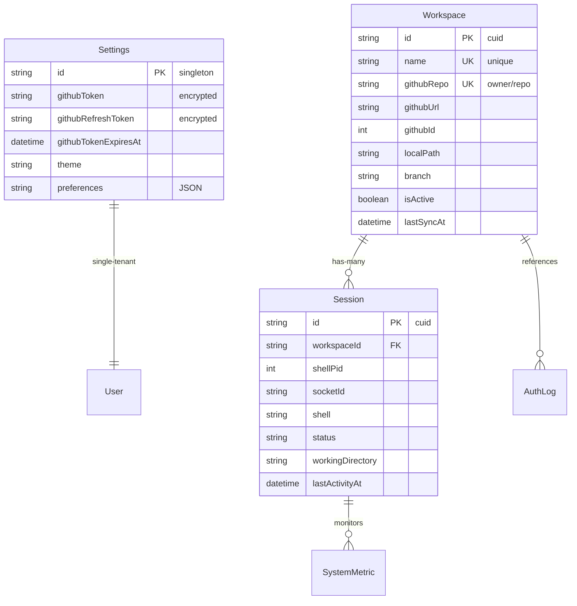

# Data Models

AI Code Terminal uses a carefully designed data model that supports single-tenant operation, workspace isolation, and real-time session management. This guide covers the business logic, relationships, and usage patterns for each model.

## Model Relationships Overview



## Settings Model Business Logic

### Single-Tenant Configuration

The Settings model implements the singleton pattern for single-tenant configuration:

```typescript
export class SettingsModel {
  private static readonly SINGLETON_ID = 'singleton';

  // Ensure only one settings record exists
  static async getInstance(): Promise<Settings | null> {
    return await prisma.settings.findUnique({
      where: { id: this.SINGLETON_ID }
    });
  }

  // Create or update settings (upsert pattern)
  static async upsert(data: Partial<Omit<Settings, 'id' | 'createdAt' | 'updatedAt'>>) {
    return await prisma.settings.upsert({
      where: { id: this.SINGLETON_ID },
      update: {
        ...data,
        updatedAt: new Date()
      },
      create: {
        id: this.SINGLETON_ID,
        ...data
      }
    });
  }

  // Specialized methods for common operations
  static async updateTheme(theme: string) {
    return await this.upsert({ theme });
  }

  static async updatePreferences(preferences: Record<string, any>) {
    return await this.upsert({
      preferences: JSON.stringify(preferences)
    });
  }

  static async getPreferences(): Promise<Record<string, any>> {
    const settings = await this.getInstance();
    if (!settings?.preferences) {
      return {};
    }
    
    try {
      return JSON.parse(settings.preferences);
    } catch {
      return {};
    }
  }
}
```

### GitHub Token Management

Secure token storage with encryption:

```typescript
import crypto from 'crypto';

export class GitHubTokenManager {
  private static algorithm = 'aes-256-cbc';
  private static secretKey = crypto.scryptSync(process.env.JWT_SECRET!, 'salt', 32);

  static encrypt(text: string): { encryptedData: string; iv: string } {
    const iv = crypto.randomBytes(16);
    const cipher = crypto.createCipher(this.algorithm, this.secretKey);
    
    let encrypted = cipher.update(text, 'utf8', 'hex');
    encrypted += cipher.final('hex');
    
    return {
      encryptedData: encrypted,
      iv: iv.toString('hex')
    };
  }

  static decrypt(encryptedData: string, iv: string): string {
    const decipher = crypto.createDecipher(this.algorithm, this.secretKey);
    
    let decrypted = decipher.update(encryptedData, 'hex', 'utf8');
    decrypted += decipher.final('utf8');
    
    return decrypted;
  }

  static async storeTokens(accessToken: string, refreshToken: string, expiresIn: number) {
    const encryptedAccess = this.encrypt(accessToken);
    const encryptedRefresh = this.encrypt(refreshToken);
    const expiresAt = new Date(Date.now() + expiresIn * 1000);

    return await SettingsModel.upsert({
      githubToken: encryptedAccess.encryptedData,
      githubTokenIv: encryptedAccess.iv,
      githubRefreshToken: encryptedRefresh.encryptedData,
      githubRefreshTokenIv: encryptedRefresh.iv,
      githubTokenExpiresAt: expiresAt
    });
  }

  static async getAccessToken(): Promise<string | null> {
    const settings = await SettingsModel.getInstance();
    
    if (!settings?.githubToken || !settings?.githubTokenIv) {
      return null;
    }

    try {
      return this.decrypt(settings.githubToken, settings.githubTokenIv);
    } catch (error) {
      console.error('Failed to decrypt GitHub token:', error);
      return null;
    }
  }

  static async isTokenExpired(): Promise<boolean> {
    const settings = await SettingsModel.getInstance();
    
    if (!settings?.githubTokenExpiresAt) {
      return true;
    }

    return new Date() >= settings.githubTokenExpiresAt;
  }

  static async clearTokens() {
    return await SettingsModel.upsert({
      githubToken: null,
      githubTokenIv: null,
      githubRefreshToken: null,
      githubRefreshTokenIv: null,
      githubTokenExpiresAt: null
    });
  }
}
```

## Workspace Model Business Logic

### Workspace Lifecycle Management

```typescript
export class WorkspaceModel {
  // Create workspace with validation
  static async create(data: CreateWorkspaceData): Promise<Workspace> {
    // Validate unique constraints
    await this.validateUniqueness(data.name, data.githubRepo);
    
    const workspace = await prisma.workspace.create({
      data: {
        ...data,
        localPath: this.generateLocalPath(data.name),
        isActive: true
      }
    });

    // Post-creation hooks
    await this.onWorkspaceCreated(workspace);
    
    return workspace;
  }

  private static async validateUniqueness(name: string, githubRepo: string) {
    const existing = await prisma.workspace.findFirst({
      where: {
        OR: [
          { name },
          { githubRepo }
        ]
      }
    });

    if (existing) {
      if (existing.name === name) {
        throw new Error(`Workspace with name "${name}" already exists`);
      }
      if (existing.githubRepo === githubRepo) {
        throw new Error(`Workspace for repository "${githubRepo}" already exists`);
      }
    }
  }

  private static generateLocalPath(name: string): string {
    const workspaceRoot = process.env.WORKSPACE_ROOT || './workspaces';
    return path.join(workspaceRoot, name);
  }

  private static async onWorkspaceCreated(workspace: Workspace) {
    // Log workspace creation
    await AuthLog.create({
      action: 'workspace_created',
      success: true,
      details: JSON.stringify({
        workspaceId: workspace.id,
        name: workspace.name,
        githubRepo: workspace.githubRepo
      })
    });

    // Create initial CLAUDE.md file
    await this.generateClaudeFile(workspace);
  }

  // Git operations
  static async syncWithRemote(workspaceId: string, operation: 'pull' | 'fetch' | 'push'): Promise<SyncResult> {
    const workspace = await this.findByIdOrThrow(workspaceId);
    
    try {
      const result = await this.performGitOperation(workspace, operation);
      
      // Update sync timestamp
      await prisma.workspace.update({
        where: { id: workspaceId },
        data: { lastSyncAt: new Date() }
      });

      return result;
    } catch (error) {
      // Log sync failure
      await AuthLog.create({
        action: `workspace_sync_${operation}`,
        success: false,
        details: JSON.stringify({
          workspaceId,
          error: error.message
        })
      });
      throw error;
    }
  }

  private static async performGitOperation(workspace: Workspace, operation: string): Promise<SyncResult> {
    const git = simpleGit(workspace.localPath);
    
    switch (operation) {
      case 'pull':
        const pullResult = await git.pull();
        return {
          operation: 'pull',
          changes: pullResult.summary,
          success: true
        };
      
      case 'fetch':
        await git.fetch();
        const status = await git.status();
        return {
          operation: 'fetch',
          behind: status.behind,
          success: true
        };
      
      case 'push':
        await git.push();
        return {
          operation: 'push',
          success: true
        };
      
      default:
        throw new Error(`Unsupported git operation: ${operation}`);
    }
  }

  // Workspace status and monitoring
  static async getStatus(workspaceId: string): Promise<WorkspaceStatus> {
    const workspace = await this.findByIdOrThrow(workspaceId);
    const git = simpleGit(workspace.localPath);
    
    const [status, log, activeSessions] = await Promise.all([
      git.status(),
      git.log({ maxCount: 1 }),
      prisma.session.findMany({
        where: {
          workspaceId,
          status: 'active'
        }
      })
    ]);

    return {
      workspace,
      git: {
        branch: status.current || 'unknown',
        ahead: status.ahead,
        behind: status.behind,
        modified: status.modified,
        staged: status.staged,
        untracked: status.not_added,
        lastCommit: log.latest
      },
      sessions: activeSessions.length,
      lastActivity: this.calculateLastActivity(workspace, activeSessions)
    };
  }

  // Cleanup and maintenance
  static async cleanupInactive(inactiveDays: number = 30): Promise<number> {
    const cutoff = new Date(Date.now() - inactiveDays * 24 * 60 * 60 * 1000);
    
    const inactiveWorkspaces = await prisma.workspace.findMany({
      where: {
        isActive: false,
        updatedAt: { lt: cutoff },
        sessions: {
          none: {
            status: 'active'
          }
        }
      }
    });

    let cleanedCount = 0;
    for (const workspace of inactiveWorkspaces) {
      try {
        await this.deleteWithCleanup(workspace.id);
        cleanedCount++;
      } catch (error) {
        console.error(`Failed to cleanup workspace ${workspace.id}:`, error);
      }
    }

    return cleanedCount;
  }

  private static async deleteWithCleanup(workspaceId: string): Promise<void> {
    const workspace = await this.findByIdOrThrow(workspaceId);
    
    // Remove filesystem directory
    if (fs.existsSync(workspace.localPath)) {
      await fs.promises.rm(workspace.localPath, { recursive: true });
    }

    // Database cleanup (cascade will handle sessions)
    await prisma.workspace.delete({
      where: { id: workspaceId }
    });

    // Log deletion
    await AuthLog.create({
      action: 'workspace_deleted',
      success: true,
      details: JSON.stringify({
        workspaceId,
        name: workspace.name
      })
    });
  }
}
```

### Workspace Directory Management

```typescript
export class WorkspaceFileManager {
  static async ensureWorkspaceDirectory(workspace: Workspace): Promise<void> {
    const dir = workspace.localPath;
    
    if (!fs.existsSync(dir)) {
      await fs.promises.mkdir(dir, { recursive: true });
    }

    // Set appropriate permissions (owner read/write/execute)
    await fs.promises.chmod(dir, 0o755);
  }

  static async generateClaudeFile(workspace: Workspace): Promise<void> {
    const claudeFilePath = path.join(workspace.localPath, 'CLAUDE.md');
    
    // Don't overwrite existing CLAUDE.md
    if (fs.existsSync(claudeFilePath)) {
      return;
    }

    const content = await this.generateClaudeContent(workspace);
    await fs.promises.writeFile(claudeFilePath, content, 'utf8');
  }

  private static async generateClaudeContent(workspace: Workspace): Promise<string> {
    const packageJsonPath = path.join(workspace.localPath, 'package.json');
    let projectInfo = { name: workspace.name, description: '' };

    // Read project information if available
    if (fs.existsSync(packageJsonPath)) {
      try {
        const packageJson = JSON.parse(await fs.promises.readFile(packageJsonPath, 'utf8'));
        projectInfo = {
          name: packageJson.name || workspace.name,
          description: packageJson.description || ''
        };
      } catch (error) {
        console.warn('Failed to read package.json:', error);
      }
    }

    return `# ${projectInfo.name}

## Project Overview
${projectInfo.description || 'AI Code Terminal workspace for ' + workspace.githubRepo}

## Repository Information
- **GitHub Repository:** ${workspace.githubRepo}
- **Repository URL:** ${workspace.githubUrl}
- **Local Path:** ${workspace.localPath}
- **Default Branch:** ${workspace.branch}

## Getting Started
This workspace was automatically created by AI Code Terminal. You have full access to:
- Terminal commands
- Git operations
- File system operations
- Claude Code integration

## Common Commands
\`\`\`bash
# Git operations
git status
git pull
git push

# Development
npm install
npm run dev
npm test

# Claude integration
claude chat "Help me understand this codebase"
claude analyze
\`\`\`

## Workspace Features
- **Real-time terminal:** Full shell access in your browser
- **Git integration:** Seamless GitHub operations
- **Claude Code:** AI-powered development assistance
- **Session persistence:** Your work is automatically saved

---
*This file was automatically generated by AI Code Terminal*
*Last updated: ${new Date().toISOString()}*
`;
  }

  static async getWorkspaceSize(workspace: Workspace): Promise<number> {
    if (!fs.existsSync(workspace.localPath)) {
      return 0;
    }

    return await this.calculateDirectorySize(workspace.localPath);
  }

  private static async calculateDirectorySize(dirPath: string): Promise<number> {
    const files = await fs.promises.readdir(dirPath);
    let size = 0;

    for (const file of files) {
      const filePath = path.join(dirPath, file);
      const stats = await fs.promises.stat(filePath);

      if (stats.isDirectory()) {
        size += await this.calculateDirectorySize(filePath);
      } else {
        size += stats.size;
      }
    }

    return size;
  }
}
```

## Session Model Business Logic

### Terminal Session Management

```typescript
export class SessionModel {
  // Create new terminal session
  static async createTerminalSession(
    workspaceId: string, 
    socketId: string, 
    options: SessionOptions = {}
  ): Promise<Session> {
    const workspace = await prisma.workspace.findUnique({
      where: { id: workspaceId }
    });

    if (!workspace) {
      throw new Error(`Workspace not found: ${workspaceId}`);
    }

    const session = await prisma.session.create({
      data: {
        workspaceId,
        socketId,
        shell: options.shell || 'bash',
        workingDirectory: workspace.localPath,
        environment: JSON.stringify(this.prepareEnvironment(workspace, options.environment)),
        status: 'active'
      }
    });

    // Start terminal process
    const terminalProcess = await this.spawnTerminalProcess(session, workspace);
    
    // Update session with process info
    return await prisma.session.update({
      where: { id: session.id },
      data: { shellPid: terminalProcess.pid }
    });
  }

  private static prepareEnvironment(
    workspace: Workspace, 
    customEnv: Record<string, string> = {}
  ): Record<string, string> {
    return {
      ...process.env,
      HOME: workspace.localPath,
      PWD: workspace.localPath,
      WORKSPACE_NAME: workspace.name,
      WORKSPACE_REPO: workspace.githubRepo,
      ...customEnv
    };
  }

  private static async spawnTerminalProcess(session: Session, workspace: Workspace): Promise<ChildProcess> {
    const environment = JSON.parse(session.environment || '{}');
    
    const terminalProcess = spawn(session.shell, [], {
      cwd: workspace.localPath,
      env: environment,
      stdio: ['pipe', 'pipe', 'pipe']
    });

    // Handle process events
    terminalProcess.on('exit', async (code, signal) => {
      await this.handleProcessExit(session.id, code, signal);
    });

    terminalProcess.on('error', async (error) => {
      await this.handleProcessError(session.id, error);
    });

    return terminalProcess;
  }

  // Session activity tracking
  static async updateActivity(sessionId: string): Promise<void> {
    await prisma.session.update({
      where: { id: sessionId },
      data: { lastActivityAt: new Date() }
    });
  }

  static async getActiveSessions(workspaceId?: string): Promise<SessionWithWorkspace[]> {
    return await prisma.session.findMany({
      where: {
        status: 'active',
        ...(workspaceId && { workspaceId })
      },
      include: {
        workspace: true
      },
      orderBy: { lastActivityAt: 'desc' }
    });
  }

  // Session termination
  static async terminateSession(sessionId: string, exitCode?: number): Promise<void> {
    const session = await prisma.session.findUnique({
      where: { id: sessionId }
    });

    if (!session) {
      throw new Error(`Session not found: ${sessionId}`);
    }

    // Kill process if still running
    if (session.shellPid) {
      try {
        process.kill(session.shellPid, 'SIGTERM');
        
        // Force kill after 5 seconds
        setTimeout(() => {
          if (session.shellPid) {
            try {
              process.kill(session.shellPid, 'SIGKILL');
            } catch (error) {
              // Process already terminated
            }
          }
        }, 5000);
      } catch (error) {
        // Process already terminated
      }
    }

    // Update session status
    await prisma.session.update({
      where: { id: sessionId },
      data: {
        status: 'terminated',
        endedAt: new Date(),
        exitCode: exitCode || 0
      }
    });
  }

  private static async handleProcessExit(sessionId: string, code: number | null, signal: NodeJS.Signals | null): Promise<void> {
    await prisma.session.update({
      where: { id: sessionId },
      data: {
        status: 'terminated',
        endedAt: new Date(),
        exitCode: code
      }
    });

    // Log session termination
    await AuthLog.create({
      action: 'session_terminated',
      success: true,
      details: JSON.stringify({
        sessionId,
        exitCode: code,
        signal
      })
    });
  }

  private static async handleProcessError(sessionId: string, error: Error): Promise<void> {
    await prisma.session.update({
      where: { id: sessionId },
      data: {
        status: 'terminated',
        endedAt: new Date()
      }
    });

    // Log session error
    await AuthLog.create({
      action: 'session_error',
      success: false,
      details: JSON.stringify({
        sessionId,
        error: error.message
      })
    });
  }

  // Session cleanup and maintenance
  static async cleanupInactiveSessions(inactiveMinutes: number = 60): Promise<number> {
    const cutoff = new Date(Date.now() - inactiveMinutes * 60 * 1000);
    
    const inactiveSessions = await prisma.session.findMany({
      where: {
        status: 'active',
        lastActivityAt: { lt: cutoff }
      }
    });

    let cleanedCount = 0;
    for (const session of inactiveSessions) {
      try {
        await this.terminateSession(session.id);
        cleanedCount++;
      } catch (error) {
        console.error(`Failed to cleanup session ${session.id}:`, error);
      }
    }

    return cleanedCount;
  }

  static async getSessionStatistics(): Promise<SessionStatistics> {
    const [active, total, recentTerminated] = await Promise.all([
      prisma.session.count({ where: { status: 'active' } }),
      prisma.session.count(),
      prisma.session.count({
        where: {
          status: 'terminated',
          endedAt: {
            gte: new Date(Date.now() - 24 * 60 * 60 * 1000) // Last 24 hours
          }
        }
      })
    ]);

    return {
      active,
      total,
      terminated: recentTerminated,
      averageLifetime: await this.calculateAverageSessionLifetime()
    };
  }

  private static async calculateAverageSessionLifetime(): Promise<number> {
    const terminatedSessions = await prisma.session.findMany({
      where: {
        status: 'terminated',
        endedAt: { not: null },
        createdAt: {
          gte: new Date(Date.now() - 7 * 24 * 60 * 60 * 1000) // Last 7 days
        }
      },
      select: {
        createdAt: true,
        endedAt: true
      }
    });

    if (terminatedSessions.length === 0) {
      return 0;
    }

    const totalLifetime = terminatedSessions.reduce((sum, session) => {
      const lifetime = session.endedAt!.getTime() - session.createdAt.getTime();
      return sum + lifetime;
    }, 0);

    return totalLifetime / terminatedSessions.length;
  }
}
```

## Model Integration Patterns

### Repository Pattern Implementation

```typescript
export abstract class BaseRepository<T> {
  protected abstract model: any; // Prisma model
  protected abstract entityName: string;

  async findById(id: string): Promise<T | null> {
    return await this.model.findUnique({ where: { id } });
  }

  async findByIdOrThrow(id: string): Promise<T> {
    const entity = await this.findById(id);
    if (!entity) {
      throw new Error(`${this.entityName} not found: ${id}`);
    }
    return entity;
  }

  async create(data: any): Promise<T> {
    return await this.model.create({ data });
  }

  async update(id: string, data: any): Promise<T> {
    return await this.model.update({
      where: { id },
      data
    });
  }

  async delete(id: string): Promise<T> {
    return await this.model.delete({ where: { id } });
  }

  async findMany(where?: any, include?: any): Promise<T[]> {
    return await this.model.findMany({ where, include });
  }

  async count(where?: any): Promise<number> {
    return await this.model.count({ where });
  }
}

export class WorkspaceRepository extends BaseRepository<Workspace> {
  protected model = prisma.workspace;
  protected entityName = 'Workspace';

  async findByName(name: string): Promise<Workspace | null> {
    return await this.model.findUnique({ where: { name } });
  }

  async findByGitHubRepo(githubRepo: string): Promise<Workspace | null> {
    return await this.model.findUnique({ where: { githubRepo } });
  }

  async findActiveWorkspaces(): Promise<Workspace[]> {
    return await this.model.findMany({
      where: { isActive: true },
      orderBy: { updatedAt: 'desc' }
    });
  }
}

export class SessionRepository extends BaseRepository<Session> {
  protected model = prisma.session;
  protected entityName = 'Session';

  async findBySocketId(socketId: string): Promise<Session | null> {
    return await this.model.findFirst({ where: { socketId } });
  }

  async findActiveSessionsByWorkspace(workspaceId: string): Promise<Session[]> {
    return await this.model.findMany({
      where: {
        workspaceId,
        status: 'active'
      }
    });
  }
}
```

### Service Layer Pattern

```typescript
export class WorkspaceService {
  private workspaceRepo = new WorkspaceRepository();
  private sessionRepo = new SessionRepository();

  async createWorkspace(data: CreateWorkspaceRequest): Promise<CreateWorkspaceResponse> {
    // Business logic validation
    await this.validateWorkspaceCreation(data);
    
    // Create workspace
    const workspace = await this.workspaceRepo.create({
      ...data,
      localPath: this.generateLocalPath(data.name)
    });

    // Post-creation tasks
    await this.setupWorkspaceDirectory(workspace);
    await this.cloneRepository(workspace);
    await this.generateClaudeFile(workspace);

    return {
      workspace,
      success: true,
      message: 'Workspace created successfully'
    };
  }

  async getWorkspaceWithSessions(workspaceId: string): Promise<WorkspaceWithSessions> {
    const workspace = await this.workspaceRepo.findByIdOrThrow(workspaceId);
    const sessions = await this.sessionRepo.findActiveSessionsByWorkspace(workspaceId);
    
    return {
      ...workspace,
      activeSessions: sessions,
      sessionCount: sessions.length
    };
  }

  private async validateWorkspaceCreation(data: CreateWorkspaceRequest): Promise<void> {
    // Check for existing workspace
    const existingByName = await this.workspaceRepo.findByName(data.name);
    if (existingByName) {
      throw new Error(`Workspace with name "${data.name}" already exists`);
    }

    const existingByRepo = await this.workspaceRepo.findByGitHubRepo(data.githubRepo);
    if (existingByRepo) {
      throw new Error(`Workspace for repository "${data.githubRepo}" already exists`);
    }

    // Check workspace limits
    const activeCount = await this.workspaceRepo.count({ isActive: true });
    const maxWorkspaces = parseInt(process.env.MAX_WORKSPACES_PER_USER || '10');
    
    if (activeCount >= maxWorkspaces) {
      throw new Error(`Maximum number of workspaces (${maxWorkspaces}) reached`);
    }
  }
}
```

## Type Safety and Validation

### Generated Types with Prisma

```typescript
// Auto-generated by Prisma
export type Workspace = {
  id: string;
  name: string;
  githubRepo: string;
  githubUrl: string;
  githubId: number | null;
  localPath: string;
  branch: string;
  description: string | null;
  isActive: boolean;
  lastSyncAt: Date | null;
  createdAt: Date;
  updatedAt: Date;
};

export type Session = {
  id: string;
  shellPid: number | null;
  socketId: string | null;
  shell: string;
  status: string;
  workingDirectory: string | null;
  environment: string | null;
  lastActivityAt: Date;
  createdAt: Date;
  endedAt: Date | null;
  exitCode: number | null;
  workspaceId: string | null;
};

// Prisma-generated relations
export type WorkspaceWithSessions = Workspace & {
  sessions: Session[];
};

export type SessionWithWorkspace = Session & {
  workspace: Workspace | null;
};
```

### Runtime Validation with Zod

```typescript
import { z } from 'zod';

export const CreateWorkspaceSchema = z.object({
  name: z.string().min(1).max(50).regex(/^[a-zA-Z0-9-_]+$/),
  githubRepo: z.string().regex(/^[a-zA-Z0-9-_.]+\/[a-zA-Z0-9-_.]+$/),
  githubUrl: z.string().url(),
  githubId: z.number().int().positive().optional(),
  branch: z.string().min(1).default('main'),
  description: z.string().max(200).optional()
});

export const UpdateSessionSchema = z.object({
  status: z.enum(['active', 'paused', 'terminated']),
  workingDirectory: z.string().optional(),
  environment: z.record(z.string()).optional()
});

export const SessionOptionsSchema = z.object({
  shell: z.enum(['bash', 'zsh', 'fish']).default('bash'),
  environment: z.record(z.string()).optional(),
  workingDirectory: z.string().optional()
});

// Usage in services
export const validateAndCreateWorkspace = async (data: unknown) => {
  const validatedData = CreateWorkspaceSchema.parse(data);
  return await WorkspaceService.createWorkspace(validatedData);
};
```

## Performance Optimization

### Query Optimization Patterns

```typescript
// Efficient queries with selective loading
export const getWorkspaceDashboard = async () => {
  return await prisma.workspace.findMany({
    where: { isActive: true },
    select: {
      id: true,
      name: true,
      githubRepo: true,
      lastSyncAt: true,
      updatedAt: true,
      _count: {
        select: {
          sessions: {
            where: { status: 'active' }
          }
        }
      }
    },
    orderBy: { updatedAt: 'desc' },
    take: 10
  });
};

// Batch operations for efficiency
export const updateMultipleSessionActivity = async (sessionIds: string[]) => {
  const now = new Date();
  
  return await prisma.session.updateMany({
    where: {
      id: { in: sessionIds }
    },
    data: {
      lastActivityAt: now
    }
  });
};

// Optimized counting with filters
export const getSystemStats = async () => {
  const [workspaceStats, sessionStats] = await Promise.all([
    prisma.workspace.groupBy({
      by: ['isActive'],
      _count: { id: true }
    }),
    prisma.session.groupBy({
      by: ['status'],
      _count: { id: true }
    })
  ]);

  return {
    workspaces: workspaceStats,
    sessions: sessionStats
  };
};
```

## Next Steps

- **[Development Setup](/docs/development/setup/):** Development environment configuration
- **[Testing](/docs/development/testing/):** Model testing strategies
- **[Production Setup](/docs/deployment/production/):** Production data considerations